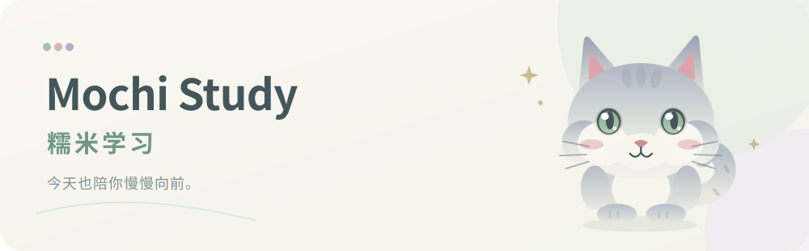
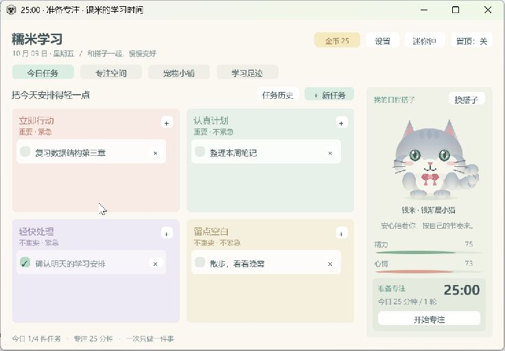

**和银米小猫一起，把专注过成柔软的小日子。**

[直接打开网页版](https://mochi-study-web.merry-ring-1591.chatgpt.site) · [下载 Windows 试用版](https://github.com/Estrella711/mochi-study/releases/download/v2.0.0-beta.1/MochiStudy-v2.0.0-beta.1-Windows-x64.zip) · [朋友试用指南](docs/FRIENDS_TEST_GUIDE.md) · [反馈问题](https://github.com/Estrella711/mochi-study/issues)

## 点链接就能用

[糯米学习网页版](https://mochi-study-web.merry-ring-1591.chatgpt.site) 已上线，无需下载、安装或登录。网页版包含四象限待办、专注/休息倒计时、用眼提醒、金币商店、学习记录，以及新增的 **金毛小狗、DDL 与独立闹钟**。

三只搭子分别命名；近期未完成 DDL 显示在页面顶部，可提前提醒。网页需要保持打开，关闭后不会响铃，后台挂起可能延后提醒或暂停计时。网页进度保存在各自浏览器，设置中可导出备份；与 Windows 存档暂不自动同步。网页支持浏览器内迷你钟；独立窗口和置顶请使用 Windows 版。

网页版源码在 [Web](Web)，使用边界和本地修改方法见 [网页版说明](Web/README.md)。Windows 发布包继续保持 v2.0.0-beta.1；以下桌面功能说明对应该版本。

## 桌面版能陪你做什么

**Mochi Study（糯米学习）**是一款可爱的 Windows 桌面学习搭子应用。用四象限安排今天，开启一轮专注，收下金币，再给小猫或小兔添一件小衣物。任务、搭子和学习进度都留在本机，无需登录。

| 功能 | 日常用法 |
| --- | --- |
| 四象限待办 | 按重要 / 紧急整理今日任务，新增、编辑、完成、删除；每日自动切换并保留历史。 |
| 桌面番茄钟 | 默认专注 **25 分钟**、短休息 **5 分钟**，每完成 **4 轮**专注后长休息 **15 分钟**；支持暂停、继续和关联任务。迷你钟可放在桌面一角，窗口可移动、调整和选用置顶。 |
| 可命名的日程搭子 | 选择银渐层小猫或糯米小兔，分别起名字；完成任务时会跳跃、举爪，并展示精力与心情。 |
| 用眼提醒 | 默认每 **20 分钟有效专注**提醒远眺，可调整或关闭；计数只来自本应用，**不监控全系统或其他应用**。 |
| 金币与宠物小铺 | 完整完成一轮专注，按该轮时长 **每分钟 1 金币**奖励；6 件帽子、衣服和饰品可购买、穿戴、卸下。 |
| 学习足迹 | 查看每日目标进度、近 7 天记录与已完成的专注，让努力留下可见的小痕迹。 |
| 本地存档与备份 | 自动保存、导出备份、保留上一份存档；兼容导入旧版 Mochi Day 的任务和历史。 |

*截图使用示例任务与演示进度，不包含个人日程；正式首次启动会从自己的本地存档开始。*

## 下载后，三步开始

1. 在 [v2.0.0-beta.1 Release](https://github.com/Estrella711/mochi-study/releases/tag/v2.0.0-beta.1) 下载 **`MochiStudy-v2.0.0-beta.1-Windows-x64.zip`**。
2. **完整解压**运行包，打开其中的 `Windows` 文件夹。
3. 双击 **`MochiStudy.exe`**。日常使用不需要 Unity 或 Visual Studio。

请保留 exe 旁边的全部文件。GitHub 自动生成的 **Source code** 是源码，不能直接双击运行。升级前请先关闭旧版窗口；更换程序文件夹不会删除本地进度。详细步骤见[朋友试用指南](docs/FRIENDS_TEST_GUIDE.md)。

## 专注与金币的规则

完成默认的一轮 25 分钟专注会获得 **25 金币**。暂停后可以继续，重置则放弃本轮；中途结束、休息时间以及反复勾选任务均不发金币。计时不代表检测你是否正在学习，离开电脑较久时请自行暂停。

关闭应用后再打开，未完成的一轮保留剩余时间并处于暂停状态。**离线、休眠和明显的应用停顿不会补算专注或金币。** 修改设置时，当前这一轮保留原时长与奖励，下一轮使用新设置。

| 宠物小铺 | 金币 | 宠物小铺 | 金币 |
| --- | ---: | --- | ---: |
| 画家贝雷帽 | 30 | 樱桃蝴蝶结 | 20 |
| 小小皇冠 | 80 | 学霸圆眼镜 | 35 |
| 奶油针织衫 | 40 | 迷你学习包 | 50 |

物品购买一次即可反复穿戴；帽子、衣服、饰品各有一个位置。两只搭子共用金币和衣柜，名字分别保存。

## 数据在哪里

任务、名字、专注记录、金币与衣柜保存在 **`%LOCALAPPDATA%\MochiDay`**。新版主存档为 `study.json`，上一份备份为 `study.json.bak`；可从应用设置导出本地备份。首次升级会导入旧版 `days.json`，保留原文件。

当前没有云同步，存档没有加密。反馈问题时请用示例任务复现，截图中隐去个人信息，不需要把正式存档上传到公开 Issues。

## 说明与继续开发

| 文档 | 适合谁 |
| --- | --- |
| [朋友试用指南](docs/FRIENDS_TEST_GUIDE.md) | 第一次下载，按步骤体验并反馈。 |
| [使用说明](docs/USER_GUIDE.zh-CN.md) | 查看任务、计时、提醒、商店与存档规则。 |
| [开发指南](docs/DEVELOPMENT.zh-CN.md) | 在 Unity / 团结引擎和 Visual Studio 中继续修改、测试、构建。 |
| [验证记录](docs/VERIFICATION.zh-CN.md) | 查看已执行的检查、实际界面验收与版本边界。 |

仓库包含完整 **`UnityProject`** 和 **`MochiStudy.sln`**。Windows 运行版在本机 **团结引擎 2022.3.61t14** 构建，已执行的编辑器、Windows Player 和独立业务逻辑检查均为 **21 / 21 通过**，详见验证记录。CI 徽章仅对应可移植的业务逻辑检查，**不是 Unity 云构建或全部 Windows UI 验证**。

这是 **beta 试用版**。当前使用标准 Windows 独立窗口，透明窗口、鼠标穿透、系统托盘、开机启动和云同步尚未加入；其他引擎版本及不同显示环境仍需验证。发现问题请到 [Issues](https://github.com/Estrella711/mochi-study/issues) 写下版本、操作步骤、预期结果和实际结果。

## 关于公开源码

项目目前公开用于展示开发过程及朋友试用，**暂未授予开源许可**。公开可见不等于开放使用许可，相关说明见 [COPYRIGHT.md](COPYRIGHT.md)。
